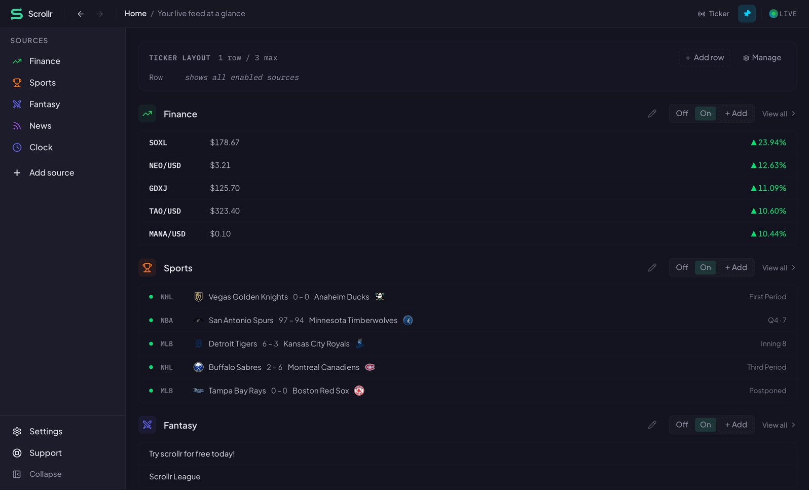
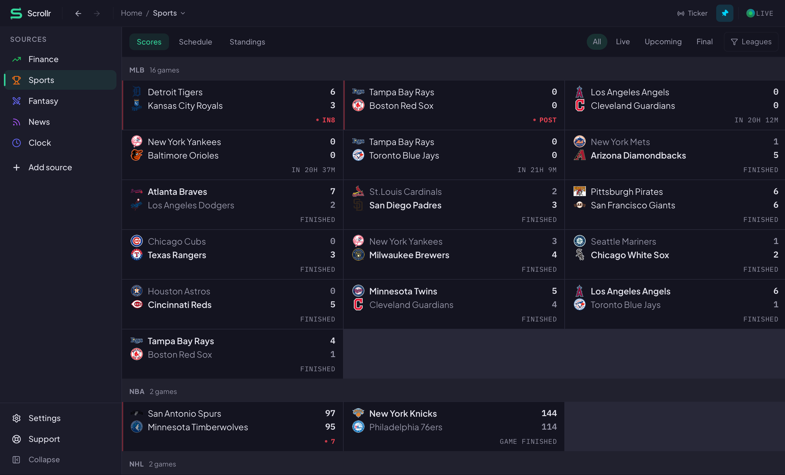
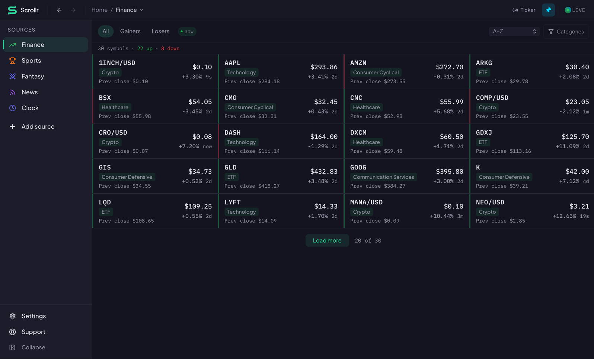
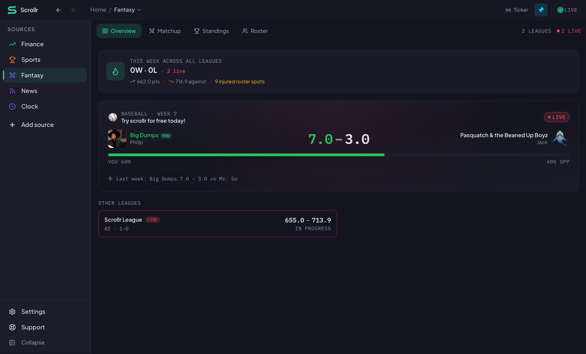
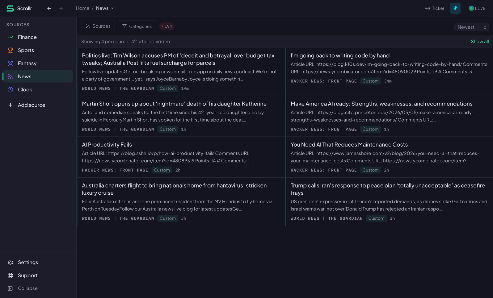

# Scrollr

**A pinned, always-on-top ticker for the things you actually care about.**

Live market quotes, fantasy matchups, game scores, and RSS feeds —
streaming into a compact bar that floats on top of whatever you're
working on. Multi-monitor aware. Zero ads. Zero telemetry.




- **Marketing site** — <https://myscrollr.com>
- **Desktop download** — <https://myscrollr.com/download>
- **Pricing / plans** — <https://myscrollr.com/uplink>
- **Status** — <https://myscrollr.com/status>

## What it looks like

Pick the sources you care about — each gets a focused view, and the
pinned ticker streams the same data across the top of your screen.

| | |
|---|---|
|  |  |
| **Sports.** Scores, schedules, and standings across MLB, NBA, NHL, NFL, and F1, all live. | **Finance.** Stocks, ETFs, and crypto with live quotes from TwelveData. |
|  |  |
| **Fantasy.** Yahoo Fantasy matchups, weekly scoring, roster injuries — across every league you play. | **News.** Hacker News plus any RSS/Atom feed you throw at it. Categorized, deduped, sorted. |

## What's in this repo

Scrollr is a monorepo of independently deployable services. Every
component has its own `go.mod` / `Cargo.toml` / `package.json` and no
shared source libraries — the only contract between services is HTTP.

| Path | Service | Stack |
|---|---|---|
| [`desktop/`](./desktop/) | Desktop app (the primary product) | Tauri v2 + React 19 + Vite 7 |
| [`myscrollr.com/`](./myscrollr.com/) | Marketing site, pricing, billing | React 19 + Vite + TanStack Router |
| [`api/`](./api/) | Core gateway API | Go 1.22 + Fiber v2 + Postgres + Redis |
| [`channels/finance/`](./channels/finance/) | Live market data (via TwelveData) | Go API + Rust ingestion service |
| [`channels/sports/`](./channels/sports/) | Scores + schedules (via api-sports.io) | Go API + Rust ingestion service |
| [`channels/rss/`](./channels/rss/) | RSS/Atom feeds | Go API + Rust ingestion service |
| [`channels/fantasy/`](./channels/fantasy/) | Yahoo Fantasy Sports (OAuth) | Go-native (no Rust service) |
| [`k8s/`](./k8s/) | Production manifests | Kubernetes on DigitalOcean / Coolify |
| [`scripts/`](./scripts/) | Operational tooling | Mixed Go / shell |
| [`docs/superpowers/specs/`](./docs/superpowers/) | Design specs that predate every merge | Markdown |

## How it fits together

```
┌──────────────────┐       ┌──────────────────┐
│  desktop app     │       │  myscrollr.com   │
│  (Tauri + React) │       │  (React + Vite)  │
└────────┬─────────┘       └────────┬─────────┘
         │                          │
         │   JWTs via Logto         │
         ▼                          ▼
    ┌────────────────────────────────────┐
    │   Core API  (api/ · Go · Fiber)    │  ← only JWT validator
    │   /users/me, /dashboard, /events,  │
    │   /checkout, /tier-limits, …       │
    └──┬─────────────────────────────────┘
       │ X-User-Sub header, HTTP only
       │
       ├─────────┬──────────┬────────────┐
       ▼         ▼          ▼            ▼
    Finance   Sports      RSS         Fantasy
    Go API    Go API      Go API      Go API
       │         │          │            │
       ▼         ▼          ▼            (in-process
    Rust       Rust       Rust            Yahoo sync,
    ingestion  ingestion  ingestion       no separate
    (TwelveD.) (api-spt)  (feed-rs)       Rust service)
```

- **Core API is the only service that validates JWTs.** Channel APIs
  trust the `X-User-Sub` header set by the proxy.
- **Channels self-register in Redis.** Adding a new channel means
  adding a service; the core API discovers it dynamically and proxies
  `/{channel}/*` traffic.
- **Data flow back is CDC-based.** Sequin streams Postgres changes to
  Redis topics; the core API fans them out to connected desktops over
  SSE.

Read [`api/CHANNELS.md`](./api/CHANNELS.md) for the full capability /
registration / lifecycle contract.

## Quick start — just run the desktop app

Head to <https://myscrollr.com/download> and grab the build for your
OS. Macs and PCs will flag it as "from an unidentified developer" until
code signing lands in v1.0.1 — the download page explains how to allow
it.

## Quick start — local development

Full command reference is in [`AGENTS.md`](./AGENTS.md). Shortest path
to a running stack:

```sh
# 0. Prereqs: Node 22, Go 1.22, Rust stable, Postgres 15+, Redis 7+.
#    Plus Logto (auth) + Stripe (billing) dev projects.

# 1. Core API (runs on :8080)
cd api
cp .env.example .env && $EDITOR .env
go build ./... && go test ./...
go run .

# 2. Each channel you want to run — e.g. sports
cd channels/sports/api
go build ./... && go run .   # :8082

cd ../service
cargo run --release          # :3002

# 3. Pick a client surface to point at the API:

# a) Marketing site (http://localhost:3000)
cd myscrollr.com
cp .env.example .env && $EDITOR .env
npm install && npm run dev

# b) Desktop app
cd desktop
cp .env.example .env && $EDITOR .env
npm install && npm run tauri:dev
```

Each channel directory has its own `docker-compose.dev.yml` that
spins up Postgres, Redis, and the channel's services together if you
don't want to manage those yourself.

## Testing

- **TypeScript**: `npm run build` (includes `tsc` typecheck) in
  `myscrollr.com/` and `desktop/`.
- **Go**: `go test ./...` in `api/` and each `channels/*/api/`.
- **Rust**: `cargo test` in each `channels/{finance,sports,rss}/service/`.

CI mirrors this: `.github/workflows/backend-tests.yml` runs Go + Rust
in a matrix on every push; `.github/workflows/desktop-release.yml`
builds and releases desktop binaries; `.github/workflows/deploy.yml`
ships the API and website to production.

## Conventions

- **No shared source libraries between services.** Duplicated code
  across channels is *intentional* — do not extract. The only contract
  is HTTP.
- **No analytics, tracking pixels, or telemetry.** This is a public
  product promise, documented in the Privacy Policy. Don't add them.
- **Tier limits have one source of truth** — `DefaultTierLimits` in
  `api/core/tier_limits.go`. The desktop mirrors the numbers in
  `desktop/src/tierLimits.ts`; the marketing site fetches them at
  runtime from `/tier-limits`. Changing any of the three requires
  updating all three in the same PR.
- **Database migrations are versioned.** `golang-migrate` for Go
  modules, `sqlx::migrate` for Rust crates. Both run on startup — a
  failed migration crashes the container.
- **Rollbacks via rolling forward.** We prefer forward-only migrations
  once deployed; the schema is additive wherever possible.
- **Package manager is npm.** Not pnpm, not yarn.

Per-service style (semis, quotes, path aliases) varies — see
[`AGENTS.md`](./AGENTS.md) for the exact rules in each tree.

## Documentation

- [`AGENTS.md`](./AGENTS.md) — the one-page cheatsheet: commands, ports,
  conventions, per-language rules.
- [`api/CHANNELS.md`](./api/CHANNELS.md) — channel framework + capability
  contract, with architecture diagram.
- [`CONTRIBUTING.md`](./CONTRIBUTING.md) — how to report issues, how
  to send PRs, what we do and don't merge.
- [`CODE_OF_CONDUCT.md`](./CODE_OF_CONDUCT.md) — community rules.
- [`SECURITY.md`](./SECURITY.md) — vulnerability reporting.
- [`docs/superpowers/specs/`](./docs/superpowers/specs/) — every
  feature in this repo has a dated spec that was written before it
  shipped. Best place to understand *why* something is the way it is.

## License

GNU Affero General Public License v3.0 or later (AGPL-3.0-or-later).
See [`LICENSE`](./LICENSE).

If you run a modified copy of Scrollr as a network service for others,
AGPL requires you to offer users of that service access to your
modified source under the same license. This is by design — Scrollr
is a SaaS-style product, and the AGPL is what keeps it open even when
operated remotely.

## Contributing

See [`CONTRIBUTING.md`](./CONTRIBUTING.md). Before your first PR,
please read the [`CODE_OF_CONDUCT.md`](./CODE_OF_CONDUCT.md) and the
[`SECURITY.md`](./SECURITY.md).

## Credits

- Built by Brandon Ruth and the Scrollr contributors.
- Desktop app powered by [Tauri](https://tauri.app).
- Market data from [TwelveData](https://twelvedata.com).
- Sports data from [api-sports.io](https://api-sports.io).
- Fantasy data from [Yahoo Fantasy Sports API](https://developer.yahoo.com/fantasysports/).
- Auth by [Logto](https://logto.io).
- Billing by [Stripe](https://stripe.com).
- Infrastructure on [DigitalOcean](https://digitalocean.com) via
  [Coolify](https://coolify.io).
